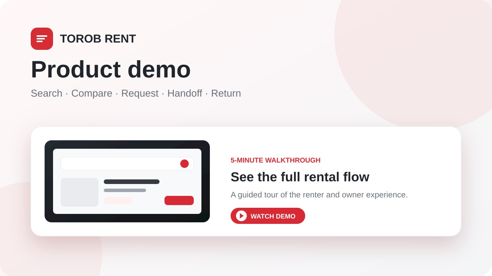
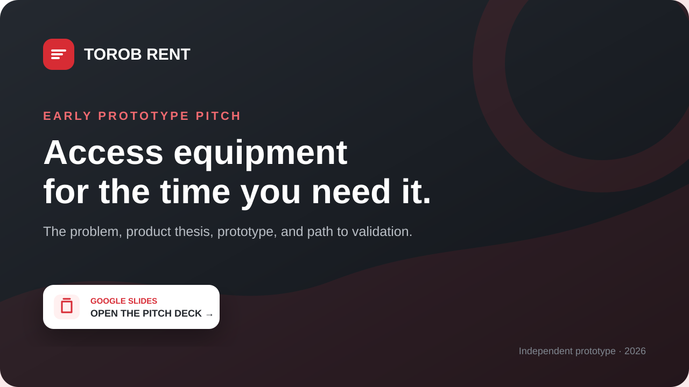

# Torob Rent / ترب اجاره

An independent hiring-challenge prototype for renting a MacBook in Tehran for a short editing project. The personas and inventory are hypotheses. This is not an official Torob service.

**Application:** https://torob-rent.xdo-run.ir

Every new visitor receives a private demo workspace with 12 synthetic offers and separate owner/renter identities. Switch roles in the demo strip. Real email/password accounts use a separate marketplace; no inventory or demand is claimed to be real. All payments are simulated. No money, identity documents, escrow, insurance or guarantees are collected.

## Demo & pitch

<table>
  <tr>
    <td width="50%" align="center">
      <a href="https://drive.google.com/file/d/1-IcG8VHDeTFZvfL6GRQhJX3RYGUus-cL/view">
        
      </a>
      <br />
      <strong>Product demo</strong>
      <br />
      <sub>Watch the renter and owner journey from search to return.</sub>
      <br /><br />
      <a href="https://drive.google.com/file/d/1-IcG8VHDeTFZvfL6GRQhJX3RYGUus-cL/view"><strong>▶ Watch the video</strong></a>
    </td>
    <td width="50%" align="center">
      <a href="https://docs.google.com/presentation/d/1gJVFulfV0j18XUsSdN8LsgQy4IOhug37V1kQ8Bm0BXQ/present?slide=id.p1">
        
      </a>
      <br />
      <strong>Early prototype pitch</strong>
      <br />
      <sub>Explore the problem, product thesis, prototype, and next step.</sub>
      <br /><br />
      <a href="https://docs.google.com/presentation/d/1gJVFulfV0j18XUsSdN8LsgQy4IOhug37V1kQ8Bm0BXQ/present?slide=id.p1"><strong>▣ Open the slides</strong></a>
    </td>
  </tr>
</table>

<p align="center">
  <a href="https://torob-rent.xdo-run.ir"><strong>Launch the live prototype →</strong></a>
  &nbsp;·&nbsp;
  <a href="https://drive.google.com/drive/folders/1ciNEOjmt7-EZactip1K3wrhLVV2AyrAf">Browse all demo materials</a>
</p>

## What works

- Persian RTL search, editable extracted criteria, Jalali dates and Persian/Arabic numerals; strict budget, deposit, neighborhood and availability filters.
- Up to three offers compared by rental cost, refundable deposit, specifications and non-cash conditions. Suitability explanations use stored facts and explicit rules.
- Owner listing drafts, mandatory review, create/edit/publish/pause, blocked date ranges and persistent JPEG/PNG/WebP uploads.
- Transactional request → acceptance → handoff → return flow, immutable agreement snapshots, idempotent retries and database-enforced overlap exclusion.
- Private demo analytics; durable aggregate reporting in the existing Prometheus/Grafana stack.
- Optional structured AI provider with validation, timeouts, limits, usage tracking and explicit deterministic fallback. **Live AI is not configured.**

## Run locally

Use Node.js 22+ and PostgreSQL 18 with UTF-8. `package-lock.json` pins the tested dependency graph.

```sh
npm ci
```

For a convenient local database, run `npm run db:local` in its own terminal. It initializes persistent PostgreSQL on `127.0.0.1:55439`, creates a UTF-8 database and writes a random password to ignored `.env.local`. Alternatively copy `.env.example` to `.env.local`, configure your own database and generate `METRICS_TOKEN` securely.

```sh
npm run db:migrate
npm run dev
```

Open http://localhost:14567. `npm run db:seed` creates an isolated **test** workspace; supplying the same `SEED_WORKSPACE_ID` makes seeding idempotent. Browser demo sessions seed on demand with dates relative to today. Seeding never fabricates funnel events or bookings.

```sh
npm run typecheck
npm run lint
npm test
npm run test:integration
npm run eval
node scripts/http-smoke.mjs
npm run build
```

## Architecture and correctness

Next.js App Router + React + TypeScript modular monolith; PostgreSQL via Drizzle for typed listing reads and node-postgres transactions for booking operations. Tailwind tooling and custom CSS provide a compact responsive marketplace. Self-hosted Vazirmatn fonts avoid third-party font requests. The container runs as an unprivileged user with persistent database/media volumes.

`lib/domain.ts` owns validation, dates, integer money and suitability rules. `lib/marketplace.ts` owns permissions and transactional operations. API routes enforce authenticated sessions, same-origin writes, body limits and database-backed rate limits. `lib/ai.ts` is the only provider integration. `db/migrations` are versioned and applied in one advisory-locked transaction. Aggregate-only reporting views isolate Grafana from user records.

All money is integer **IRT (toman)**, displayed as تومان. Explicit rial amounts in Persian text are divided by ten. Rental intervals are **[pickup, return)** at 12:00 Asia/Tehran; return day is excluded, duration 1–30 days, new requests start tomorrow or later. Dates are PostgreSQL `date`; audit times are `timestamptz`. The accepted value comes from the request's immutable server quote and terms, so edits never silently change an agreement.

| State | Allowed next action | Availability |
|---|---|---|
| requested | Owner accepts/rejects; either party cancels; server expires | Not reserved |
| accepted | Owner records handoff; either party cancels before start day | Reserved |
| handed_over | Owner records return | Reserved |
| completed | Terminal | Original interval remains occupied |
| rejected / cancelled / expired | Terminal | Released |

Pending requests expire after 24 hours or pickup noon, whichever occurs first. A one-minute maintenance timer and booking reads/transitions apply expiry and durable events. An exclusion constraint on `listing_id` and `daterange(...,'[)')` prevents overlapping accepted/handed-over/completed rentals even under concurrent acceptance. Adjacent bookings are allowed. Owner self-rental and cross-workspace access are rejected. Handoff/return require condition notes, accessory reconciliation and data preparation confirmation. Demo mode permits early handoff for a five-minute demonstration; real accounts do not.

## AI configuration and tradeoffs

Set `AI_API_KEY`, `AI_MODEL`, and optionally `AI_BASE_URL` in the server environment. The integration uses OpenAI-compatible Chat Completions with strict JSON-schema output. Both outputs are validated again with Zod. The model receives untrusted text as data, has no tools, and cannot book or edit listings. Provider errors, malformed output, invalid schema and timeouts fall back explicitly. Input is limited to 3,000 characters; output to 1,200 tokens; provider timeout defaults to 10 seconds; calls are limited per workspace and globally. Token prices are optional and estimated cost remains unavailable until both are configured.

Without a provider, deterministic parsing extracts explicitly stated specs and Persian search criteria. It does not simulate model output. Missing specs remain unknown. Rules require 8 GB for basic 1080p, 16 GB for 4K, 32 GB plus Apple Silicon for heavy editing. These are conservative product heuristics, **not benchmarks or guaranteed compatibility**; codec, software version, proxies and free storage require confirmation. Balanced sorting combines actual rental cost with 1% of refundable deposit as a visible cash-exposure heuristic, not a performance score.

Production limitations: password recovery/email verification and payments are not implemented; no public-contact discovery, dispute resolution, damage assessment or identity verification. Demo records have no automatic retention purge yet, so monitor storage and schedule an explicit retention policy before larger use. Uploaded images are decoded/re-encoded to WebP (max input 5 MB/20 MP), resized and stripped of metadata; virus scanning is not claimed. Cookie sessions last seven days. Business analytics are daily Tehran cohorts and can backfill as rentals complete.

## Operations and evidence

- [Deployment, backup and rollback](docs/DEPLOYMENT.md)
- [KPI dictionary](docs/KPIS.md)
- [Test evidence](docs/TESTING.md) and [Persian AI evaluation](docs/evidence/ai-evaluation.json)
- [Five-minute Persian demo](docs/DEMO.fa.md)
- [Image sources and rights](docs/ASSETS.md)

Authenticated Grafana dashboards: [Health](https://grafana.foroush-yar.ir/d/torob-health), [Product funnel](https://grafana.foroush-yar.ir/d/torob-product), [Simulated economics](https://grafana.foroush-yar.ir/d/torob-economics). Use the existing Grafana login; the app does not expose administrative credentials.

Implementation references checked: [Next.js deployment](https://nextjs.org/docs/app/getting-started/deploying), [PostgreSQL range constraints](https://www.postgresql.org/docs/current/rangetypes.html), [node-postgres transactions](https://node-postgres.com/features/transactions), [Structured outputs](https://developers.openai.com/api/docs/guides/structured-outputs), [Prometheus configuration](https://prometheus.io/docs/prometheus/latest/configuration/configuration/), [Grafana provisioning](https://grafana.com/docs/grafana/latest/administration/provisioning/).
